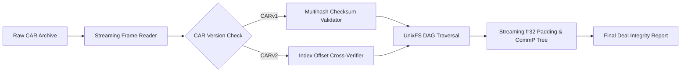

# fil-retrieval-guard

> **High-Performance Streaming CARv1/v2 & Piece CID (CommP) Integrity Verification Engine for Filecoin Storage Deals**

`fil-retrieval-guard` is a deterministic, memory-safe verification engine and CLI tool designed to validate Content Addressable Archives (CARv1 & CARv2) and compute exact Piece CIDs (`commP`) in streaming fashion without loading gigabyte-scale datasets into RAM.

---

## The Problem
When storage clients prepare gigabyte- or terabyte-scale datasets for Filecoin storage deals, verifying archive integrity, block offsets, and Piece CIDs locally is computationally expensive and memory-intensive:
- **Out of Memory (OOM):** Most off-the-shelf verification scripts buffer entire CAR files or large chunks into memory, failing on consumer/developer hardware when verifying realistic 10GB–32GB+ archives.
- **Silent Index Inconsistencies:** CARv2 files include index tables (`IndexSorted`, `MultihashIndexSorted`). If an index entry points to an incorrect payload block offset, current drag-and-drop tools fail to notice until the Storage Provider (SP) rejects the deal on-chain.
- **Broken DAG Links:** Dangling pointers in UnixFS `dag-pb` structures lead to unretrievable blocks after deals are committed.

## Key Capabilities
- **Streaming Pipeline Architecture:** Constant memory consumption (< 64MB RAM) regardless of archive size (tested up to 32GB+).
- **CARv1 & CARv2 Conformance:** Zero-allocation header parsing, varint frame extraction, and index-to-payload cross-verification.
- **Streaming CommP Engine:** Filecoin fr32 padding and binary SHA-256 Merkle tree calculation matching `go-fil-commp-hashhash` byte-for-byte.
- **Developer CLI (`fil-guard`):** Single-binary CLI with human-friendly diagnostics and machine-readable `--json` output for CI/CD pipelines.
- **GitHub Action:** Reusable pre-flight workflow step for automated dataset releases.

---

## Architecture

---

## Development Milestones

Tracked in [Filecoin DevGrant Proposal #2199](https://github.com/filecoin-project/devgrants/issues/2199):

* **Milestone 1:** Core Streaming Parser & CAR Integrity Engine (Streaming CARv1/v2, index cross-validation, UnixFS link traversal, fixture corpus).
* **Milestone 2:** Streaming Piece CID (CommP) Engine (fr32 padding, two-phase Merkle tree, exact parity against `go-fil-commp-hashhash`).
* **Milestone 3:** Production CLI (`fil-guard`), GitHub Action runner, documentation, and standalone binary packaging.

---

## License
Dual-licensed under either:
* Apache License, Version 2.0 ([LICENSE-APACHE](LICENSE-APACHE))
* MIT License ([LICENSE-MIT](LICENSE-MIT))
